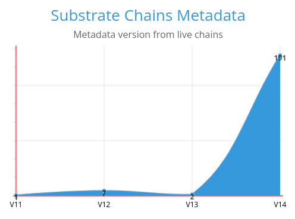

# We scanned 200 wss endpoints, this is what we found  

### Summary:
Uptest is a substrate runtime upgrade tool that we recently started developing. In our journey we looked at what metadata versions the current live substrate based chains are running by scanning 200 wss endpoints. We wanted to know what metadata versions the ecosystem was running.


### What is substrate's metadata?
When you connect to a substrate based chain, the chain provides description metadata of the pallets, extrinsic and types. When you send data using the chain api you utilize the SCALE codec, a lightweight alternative to [serde](https://serde.rs/) that handle's the deserialization of the data. 
This metadata comes in 14 different formats, where version 14 is the latest. 

In order to decode the metadata in the correct way we need to know what version the chain is using.


You can find the metadata version of your substrate based chain by quering `state > getMetadata`


```shell
curl -H "Content-Type: application/json" -d '{"id":1, "jsonrpc":"2.0", "method": "state_getMetadata"}'  \\ 
http://127.0.0.1:9933
```


### What metadata version is being used in the ecosystem?




| Version         | Amount     | Technical implementation |
|--------------|-----------|------------|
| 11 | 1      | [v11.rs](https://github.com/paritytech/frame-metadata/blob/f84ba3ff49559e37c8ebe4ea483fc2cc90d1dcdb/frame-metadata/src/v11.rs)        |
| 12     | 7  | [v12.rs](https://github.com/paritytech/frame-metadata/blob/f84ba3ff49559e37c8ebe4ea483fc2cc90d1dcdb/frame-metadata/src/v12.rs)       |
| 13 | 2      | [v13.rs](https://github.com/paritytech/frame-metadata/blob/f84ba3ff49559e37c8ebe4ea483fc2cc90d1dcdb/frame-metadata/src/v13.rs)        |
| 14      | 191  | [v14.rs](https://github.com/paritytech/frame-metadata/blob/f84ba3ff49559e37c8ebe4ea483fc2cc90d1dcdb/frame-metadata/src/v14.rs)       |


Our expectations where that we would find a few 9-12 versions and the majority would be version 14. 


Scan raw output data:
```
Chain at: "wss://rpc2.3dpass.org:443" has metadata version: 14
Chain at: "wss://ws.azero.dev:443" has metadata version: 14
Chain at: "wss://odyssey.aresprotocol.io:443" has metadata version: 14
Chain at: "wss://api.ata.network:443" has metadata version: 13
Chain at: "wss://fullnode.centrifuge.io:443" has metadata version: 11
Chain at: "wss://rpc.crust.network:443" has metadata version: 12
Chain at: "wss://darwinia-rpc.dwellir.com:443" has metadata version: 14
Chain at: "wss://crab-rpc.darwinia.network:443" has metadata version: 14
Chain at: "wss://darwiniacrab-rpc.dwellir.com:443" has metadata version: 14
Chain at: "wss://ws-rpc.debio.network:443" has metadata version: 14
Chain at: "wss://mainnet-node.dock.io:443" has metadata version: 12
Chain at: "wss://mainnet2.edgewa.re:443" has metadata version: 14
Chain at: "wss://edgeware.jelliedowl.net:443" has metadata version: 14
Chain at: "wss://rpc.efinity.io:443" has metadata version: 14
Chain at: "wss://node.genshiro.io:443" has metadata version: 12
Chain at: "wss://explorer-rpc-ws.mainnet.stages.humanode.io:443" has metadata version: 14
Chain at: "wss://rpc.joystream.org:443" has metadata version: 14
Chain at: "wss://ws.kusari.network:443" has metadata version: 14
Chain at: "wss://ws-rpc.myriad.social:443" has metadata version: 14
Chain at: "wss://mainnet.polkadex.trade:443" has metadata version: 14
Chain at: "wss://mainnet-rpc.polymesh.network:443" has metadata version: 14
Chain at: "wss://node.v1.riochain.io:443" has metadata version: 12
Chain at: "wss://ws.mof.sora.org:443" has metadata version: 14
Chain at: "wss://mof2.sora.org:443" has metadata version: 14
Chain at: "wss://mof3.sora.org:443" has metadata version: 14
Chain at: "wss://ws.swapdex.network:443" has metadata version: 14
Chain at: "wss://mainnet.ternoa.network:443" has metadata version: 14
Chain at: "wss://fullnode.altair.centrifuge.io:443" has metadata version: 14
Chain at: "wss://amplitude-rpc.dwellir.com:443" has metadata version: 14
Chain at: "wss://rpc-amplitude.pendulumchain.tech:443" has metadata version: 14
Chain at: "wss://rpc-parachain.bajun.network:443" has metadata version: 14
Chain at: "wss://bajun-rpc.dwellir.com:443" has metadata version: 14
Chain at: "wss://rpc.basilisk.cloud:443" has metadata version: 14
Chain at: "wss://basilisk-rpc.dwellir.com:443" has metadata version: 14
Chain at: "wss://bifrost-rpc.dwellir.com:443" has metadata version: 14
Chain at: "wss://kusama.dorafactory.org:443" has metadata version: 14
Chain at: "wss://node.genshiro.io:443" has metadata version: 12
Chain at: "wss://intern.gmordie.com:443" has metadata version: 14
Chain at: "wss://leemo.gmordie.com:443" has metadata version: 14
Chain at: "wss://ws.gm.bldnodes.org:443" has metadata version: 14
Chain at: "wss://kusama.api.integritee.network:443" has metadata version: 14
Chain at: "wss://kabocha.jelliedowl.net:443" has metadata version: 14
Chain at: "wss://karura-rpc-0.aca-api.network:443" has metadata version: 14
Chain at: "wss://karura-rpc-1.aca-api.network:443" has metadata version: 14
Chain at: "wss://karura-rpc.dwellir.com:443" has metadata version: 14
Chain at: "wss://karura.polkawallet.io:443" has metadata version: 14
Chain at: "wss://khala-rpc.dwellir.com:443" has metadata version: 14
Chain at: "wss://rpc.kico.dico.io:443" has metadata version: 14
Chain at: "wss://rpc.mainnet.listen.io:443" has metadata version: 14
Chain at: "wss://wss.mainnet.listen.io:443" has metadata version: 14
Chain at: "wss://rpc.litmus-parachain.litentry.io:443" has metadata version: 14
Chain at: "wss://c1.luhn.network:443" has metadata version: 14
Chain at: "wss://prod-kusama-collator-01.mangatafinance.cloud:443" has metadata version: 14
Chain at: "wss://moonriver.public.blastapi.io:443" has metadata version: 14
Chain at: "wss://wss.api.moonriver.moonbeam.network:443" has metadata version: 14
Chain at: "wss://heiko-rpc.parallel.fi:443" has metadata version: 14
Chain at: "wss://rpc.composablenodes.tech:443" has metadata version: 14
Chain at: "wss://us-ws-quartz.unique.network:443" has metadata version: 14
Chain at: "wss://asia-ws-quartz.unique.network:443" has metadata version: 14
Chain at: "wss://eu-ws-quartz.unique.network:443" has metadata version: 14
Chain at: "wss://rio-kusama.riocorenetwork.com:443" has metadata version: 14
Chain at: "wss://robonomics.leemo.me:443" has metadata version: 14
Chain at: "wss://robonomics.0xsamsara.com:443" has metadata version: 14
Chain at: "wss://robonomics.leemo.me:443" has metadata version: 14
Chain at: "wss://robonomics.0xsamsara.com:443" has metadata version: 14
Chain at: "wss://shiden.public.blastapi.io:443" has metadata version: 14
Chain at: "wss://shiden-rpc.dwellir.com:443" has metadata version: 14
Chain at: "wss://snow-rpc.icenetwork.io:443" has metadata version: 14
Chain at: "wss://ws.parachain-collator-1.c1.sora2.soramitsu.co.jp:443" has metadata version: 14
Chain at: "wss://para.subsocial.network:443" has metadata version: 14
Chain at: "wss://tanganika.datahighway.com:443" has metadata version: 14
Chain at: "wss://turing-rpc.dwellir.com:443" has metadata version: 14
Chain at: "wss://rpc.turing.oak.tech:443" has metadata version: 14
Chain at: "wss://rpc-0.zeitgeist.pm:443" has metadata version: 14
Chain at: "wss://zeitgeist-rpc.dwellir.com:443" has metadata version: 14
Chain at: "wss://statemine-rpc.dwellir.com:443" has metadata version: 14
Chain at: "wss://statemine-rpc-tn.dwellir.com:443" has metadata version: 14
Chain at: "wss://statemine-rpc.polkadot.io:443" has metadata version: 14
Chain at: "wss://kusama.api.encointer.org:443" has metadata version: 14
Chain at: "wss://kusama-bridge-hub-rpc.polkadot.io:443" has metadata version: 14
Chain at: "wss://kusama-rpc.dwellir.com:443" has metadata version: 14
Chain at: "wss://kusama-rpc-tn.dwellir.com:443" has metadata version: 14
Chain at: "wss://kusama-rpc.polkadot.io:443" has metadata version: 14
Chain at: "wss://ws.acurast-rococo.diamond.papers.tech:443" has metadata version: 14
Chain at: "wss://rpc-foucoco.pendulumchain.tech:443" has metadata version: 14
Chain at: "wss://arctic-rococo-rpc.icenetwork.io:443" has metadata version: 14
Chain at: "wss://rpc-rococo.bajun.network:443" has metadata version: 14
Chain at: "wss://rococo-basilisk-rpc.hydration.dev:443" has metadata version: 14
Chain at: "wss://staging.bitgreen.org:443" has metadata version: 14
Chain at: "wss://fullnode.catalyst.cntrfg.com:443" has metadata version: 14
Chain at: "wss://ws.rococo.dolphin.engineering:443" has metadata version: 14
Chain at: "wss://ethos.jur.io:443" has metadata version: 14
Chain at: "wss://rpc.rococo.frequency.xyz:443" has metadata version: 14
Chain at: "wss://rpc-rococo.helixstreet.io:443" has metadata version: 14
Chain at: "wss://rococo-hydradx-rpc.hydration.dev:443" has metadata version: 14
Chain at: "wss://rococo.imbue.network:443" has metadata version: 14
Chain at: "wss://rococo.api.integritee.network:443" has metadata version: 14
Chain at: "wss://kabsoup1.jelliedowl.com:443" has metadata version: 14
Chain at: "wss://rpc.rococo-parachain-sg.litentry.io:443" has metadata version: 14
Chain at: "wss://roccoco-testnet-collator-01.mangatafinance.cloud:443" has metadata version: 14
Chain at: "wss://c1.md5.network:443" has metadata version: 14
Chain at: "wss://rococo.kilt.io:443" has metadata version: 14
Chain at: "wss://rococo.rpc.robonomics.network:443" has metadata version: 14
Chain at: "wss://rco-para.subsocial.network:443" has metadata version: 14
Chain at: "wss://spreehafen.datahighway.com:443" has metadata version: 14
Chain at: "wss://s-ui.kapex.network:443" has metadata version: 14
Chain at: "wss://staging.para.sub.zero.io:443" has metadata version: 14
Chain at: "wss://ws.t0rn.io:443" has metadata version: 14
Chain at: "wss://rpc.turing-staging.oak.tech:443" has metadata version: 14
Chain at: "wss://rpc.dev.watr.org:443" has metadata version: 14
Chain at: "wss://rococo-rockmine-rpc.polkadot.io:443" has metadata version: 14
Chain at: "wss://rococo-contracts-rpc.polkadot.io:443" has metadata version: 14
Chain at: "wss://rococo.api.encointer.org:443" has metadata version: 14
Chain at: "wss://rococo-bridge-hub-rpc.polkadot.io:443" has metadata version: 14
Chain at: "wss://rococo-rpc.polkadot.io:443" has metadata version: 14
Chain at: "wss://test-rpc.3dpass.org:443" has metadata version: 14
Chain at: "wss://rpc-test.ajuna.network:443" has metadata version: 14
Chain at: "wss://ws.test.azero.dev:443" has metadata version: 14
Chain at: "wss://aleph-zero-testnet-rpc.dwellir.com:443" has metadata version: 14
Chain at: "wss://gladios.aresprotocol.io:443" has metadata version: 14
Chain at: "wss://cf-api.ata.network:443" has metadata version: 13
Chain at: "wss://beresheet.jelliedowl.net:443" has metadata version: 14
Chain at: "wss://spreehafen.datahighway.com:443" has metadata version: 14
Chain at: "wss://ws-rpc.testnet.debio.network:443" has metadata version: 14
Chain at: "wss://knox-1.dock.io:443" has metadata version: 14
Chain at: "wss://gesell.encointer.org:443" has metadata version: 14
Chain at: "wss://testnet.dev.svcs.ferrumnetwork.io:443" has metadata version: 14
Chain at: "wss://full-nodes.kilt.io:9944/:443" has metadata version: 12
Chain at: "wss://chimay.logion.network:443" has metadata version: 14
Chain at: "wss://test-rpc01.logion.network:443" has metadata version: 14
Chain at: "wss://moonbase-alpha.public.blastapi.io:443" has metadata version: 14
Chain at: "wss://wss.api.moonbase.moonbeam.network:443" has metadata version: 14
Chain at: "wss://ws-rpc.testnet.myriad.social:443" has metadata version: 14
Chain at: "wss://asia-ws-opal.unique.network:443" has metadata version: 14
Chain at: "wss://eu-ws-opal.unique.network:443" has metadata version: 14
Chain at: "wss://ws-opal.unique.network:443" has metadata version: 14
Chain at: "wss://us-ws-opal.unique.network:443" has metadata version: 14
Chain at: "wss://pangolin-rpc.darwinia.network:443" has metadata version: 14
Chain at: "wss://pangoro-rpc.darwinia.network:443" has metadata version: 14
Chain at: "wss://blockchain.polkadex.trade:443" has metadata version: 14
Chain at: "wss://testnet-rpc.polymesh.live:443" has metadata version: 14
Chain at: "wss://sherpax-testnet.chainx.org:443" has metadata version: 14
Chain at: "wss://shibuya-rpc.dwellir.com:443" has metadata version: 14
Chain at: "wss://staging.rpc.skye.kiwi:443" has metadata version: 14
Chain at: "wss://ws.framenode-1.s1.stg1.sora2.soramitsu.co.jp:443" has metadata version: 14
Chain at: "wss://ws.framenode-2.s1.stg1.sora2.soramitsu.co.jp:443" has metadata version: 14
Chain at: "wss://ws.framenode-3.s2.stg1.sora2.soramitsu.co.jp:443" has metadata version: 14
Chain at: "wss://ws.framenode-4.s2.stg1.sora2.soramitsu.co.jp:443" has metadata version: 14
Chain at: "wss://tangle-archive.webb.tools:443" has metadata version: 14
Chain at: "wss://alphanet.ternoa.com:443" has metadata version: 14
Chain at: "wss://testnet2.unique.network:443" has metadata version: 12
Chain at: "wss://rpc.vara-network.io:443" has metadata version: 14
Chain at: "wss://devnet.web3games.org:443" has metadata version: 14
Chain at: "wss://bsr.zeitgeist.pm:443" has metadata version: 14
Chain at: "wss://acala-rpc-0.aca-api.network:443" has metadata version: 14
Chain at: "wss://acala-rpc-1.aca-api.network:443" has metadata version: 14
Chain at: "wss://acala-rpc.dwellir.com:443" has metadata version: 14
Chain at: "wss://acala.polkawallet.io:443" has metadata version: 14
Chain at: "wss://rpc-parachain.ajuna.network:443" has metadata version: 14
Chain at: "wss://astar.public.blastapi.io:443" has metadata version: 14
Chain at: "wss://astar-rpc.dwellir.com:443" has metadata version: 14
Chain at: "wss://mainnet.bitgreen.org:443" has metadata version: 14
Chain at: "wss://fullnode.parachain.centrifuge.io:443" has metadata version: 14
Chain at: "wss://rpc-para.clover.finance:443" has metadata version: 14
Chain at: "wss://rpc.composable.finance:443" has metadata version: 14
Chain at: "wss://crust-parachain.crustapps.net:443" has metadata version: 14
Chain at: "wss://parachain-rpc.darwinia.network:443" has metadata version: 14
Chain at: "wss://efinity-rpc.dwellir.com:443" has metadata version: 14
Chain at: "wss://rpc.efinity.io:443" has metadata version: 14
Chain at: "wss://equilibrium-rpc.dwellir.com:443" has metadata version: 14
Chain at: "wss://0.rpc.frequency.xyz:443" has metadata version: 14
Chain at: "wss://1.rpc.frequency.xyz:443" has metadata version: 14
Chain at: "wss://c1.hashed.network:443" has metadata version: 14
Chain at: "wss://hydradx-rpc.dwellir.com:443" has metadata version: 14
Chain at: "wss://rpc.hydradx.cloud:443" has metadata version: 14
Chain at: "wss://polkadot.api.integritee.network:443" has metadata version: 14
Chain at: "wss://k-ui.kapex.network:443" has metadata version: 14
Chain at: "wss://kilt-rpc.dwellir.com:443" has metadata version: 14
Chain at: "wss://litentry-rpc.dwellir.com:443" has metadata version: 14
Chain at: "wss://rpc.litentry-parachain.litentry.io:443" has metadata version: 14
Chain at: "wss://moonbeam.public.blastapi.io:443" has metadata version: 14
Chain at: "wss://wss.api.moonbeam.network:443" has metadata version: 14
Chain at: "wss://eden-rpc.dwellir.com:443" has metadata version: 14
Chain at: "wss://parachain-rpc.origin-trail.network:443" has metadata version: 14
Chain at: "wss://rpc.parallel.fi:443" has metadata version: 14
Chain at: "wss://statemint-rpc.dwellir.com:443" has metadata version: 14
Chain at: "wss://statemint-rpc-tn.dwellir.com:443" has metadata version: 14
Chain at: "wss://statemint-rpc.polkadot.io:443" has metadata version: 14
Chain at: "wss://polkadot-collectives-rpc.polkadot.io:443" has metadata version: 14
Chain at: "wss://polkadot-rpc.dwellir.com:443" has metadata version: 14
Chain at: "wss://polkadot-rpc-tn.dwellir.com:443" has metadata version: 14
Chain at: "wss://rpc.polkadot.io:443" has metadata version: 14
Chain at: "wss://westmint-rpc.dwellir.com:443" has metadata version: 14
Chain at: "wss://westmint-rpc-tn.dwellir.com:443" has metadata version: 14
Chain at: "wss://westmint-rpc.polkadot.io:443" has metadata version: 14
Chain at: "wss://westend-collectives-rpc.polkadot.io:443" has metadata version: 14
Chain at: "wss://westend-bridge-hub-rpc.polkadot.io:443" has metadata version: 14
Chain at: "wss://westend-rpc.dwellir.com:443" has metadata version: 14
Chain at: "wss://westend-rpc-tn.dwellir.com:443" has metadata version: 14
Chain at: "wss://westend-rpc.polkadot.io:443" has metadata version: 14

```

wss endpoints extracted from:
[Polkadot.js apps Github](https://github.com/polkadot-js/apps)

Manually extract it:
```shell
$ git clone https://github.com/polkadot-js/apps
$ cd apps/packages/apps-config/src/endpoints/
```


Spaghetti python code:
```python
import re, os

reg = r"\'(wss\://[0-9-a-z-\-]{1,}.*)\'"

for subdir, dirs, files in os.walk('./'):
	for pwdfilen in files:
		with open(pwdfilen, 'rb') as filen:
			for line in filen.readlines():
				loot = re.findall(reg, line.decode())
				if len(loot) >= 1:
					print(loot[0])
```


### External links:
[Follow uptest development and progress on github.com/uptest-sc/uptest](https://github.com/uptest-sc/uptest/)   
[Metadata v8-11 in frame-metadata pr](https://github.com/paritytech/frame-metadata/pull/28)   
[Read more about the scale codec here: https://docs.substrate.io/reference/scale-codec/](https://docs.substrate.io/reference/scale-codec/)   
[Metadata sp-core: https://github.com/paritytech/substrate/tree/master/primitives/core](https://github.com/paritytech/substrate/tree/master/primitives/core)  

