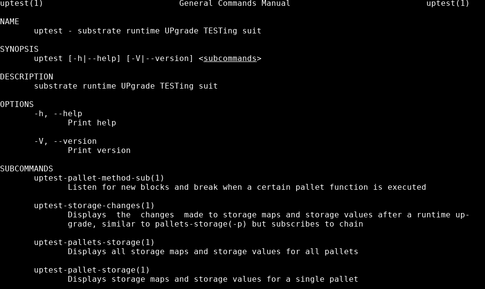

# Uptest command line tool  

> Inspiration was taken from [Daniel Stenberg's Curl](https://en.wikipedia.org/wiki/CURL) in order to create a command line client that would be flexible and easy for the end user to utilize to send and debug user-defined payloads. Just like Curl we also have Uptest the command line client and Libuptest as the core library like Libcurl.   


### Get uptest command line tool:  
```shell
$ git clone https://github.com/uptest-sc/uptest
$ cd uptest/
$ cargo build --release
$ ./target/release/uptest  
```

### Mandoc for Uptest-cli    
    
Uptest client is built with [clap]() and comes prepackaged with clap-mangen. Building uptest manually with cargo will output a mandoc file in the `target/man/uptest.man` location. Copy it to your mandoc directory which is different depending on what operating system you run.  


#### Install uptest .man on debian:   
Step 1:  
Run mandb to display the man directory path.  
```
$ mandb
Purging old database entries in /home/user/.nvm/versions/node/v17.8.0/share/man...
Processing manual pages under /home/user/.nvm/versions/node/v17.8.0/share/man...
Processing manual pages under /home/user/.nvm/versions/node/v17.8.0/share/man/cat1...
0 man subdirectories contained newer manual pages.
0 manual pages were added.
0 stray cats were added.
0 old database entries were purged.

```

Copy over the compiled man pages that was made during the build to your man page path:  
```
$ cp target/release/man/uptest.man  /home/user/.nvm/versions/node/v17.8.0/share/man/uptest.1 
```

Rebuild the man cache:  
```
$ mandb  
```

If all is well we can now read uptest documentation with `man`:

`$ man uptest`

Code source:  
[uptest cli build script](https://github.com/uptest-sc/uptest/blob/0ba314e0316b57c4999660db378e1fd71bc6f39c/build.rs#L22)   

[OpenBSD's mandoc search](https://man.openbsd.org/)    
[Debian mandoc search](https://manpages.debian.org/bookworm/cargo/cargo.1.en.html)   
