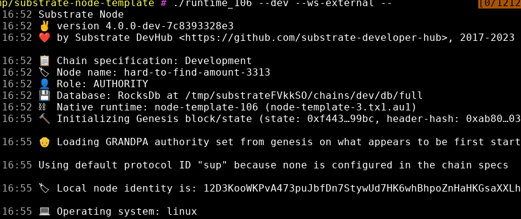
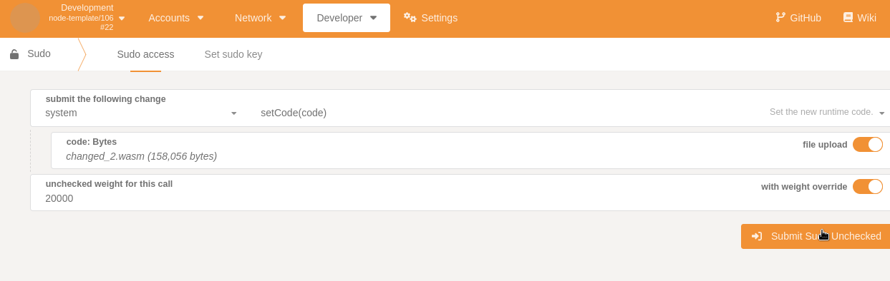

# Check added and changed storage items after a runtime upgrade
is a crucial part of doing runtime upgrades. Their are several ways to detect storage changes with Uptest.


### The simpliest way is to follow our code example `upgrade_change_diff`: 


### Spin up a substrate based node:    
```shell
git clone https://github.com/substrate-developer-hub/substrate-node-template
cd substrate-node-template/ && cargo build --release
./target/release/node-template --dev --ws-external --
```




### Run our code example:   
```shell
$ git clone https://github.com/uptest-sc/uptest/ && cd uptest
$ cargo run -p uptest-examples --example upgrade_change_diff
    Finished dev [unoptimized + debuginfo] target(s) in 0.26s
     Running `target/debug/examples/upgrade_change_diff`
Connected to: "node-template"  Runtime version: 106
Waiting for custom event to be triggered
```

### Make changes to the node repo and change spec_version:  
Make the changes you wish to do, in this example we have changed one storage map and added a storage value to the default template module you can find in the substrate-node-template repo.  
Compile the node with the saved changes and get the `target/release/wbuild/*.compressed.wasm` file.  

### Submit the runtime upgrade(in our example with the Sudo key and polkadot.js.apps webui):   

   


Head back to your terminal and you should see that we are able to detect that our custom event has been triggered and we should get the following output:  


```
Event detected in block: 0xf28159f44e72b1859a1b5fb1ff210401605b100300ed53058b939ad2c817faf4
Having a coffee break before next block...
Scanning the new metadata for changes
Runtime upgraded from version: 106 to new version: 107
Changed StorageMap: "SomeMapthree" in Pallet: "TemplateModule" to the new type: Primitive(U32)
Pallet: "TemplateModule" has added a StorageValue with the type: Primitive(Bool)
```


### External links:    
[https://github.com/substrate-developer-hub/substrate-node-template](https://github.com/substrate-developer-hub/substrate-node-template)    
[Uptest github](https://github.com/uptest-sc/uptest)   


